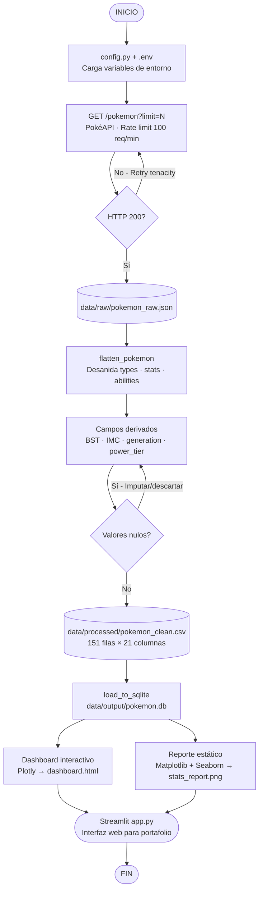
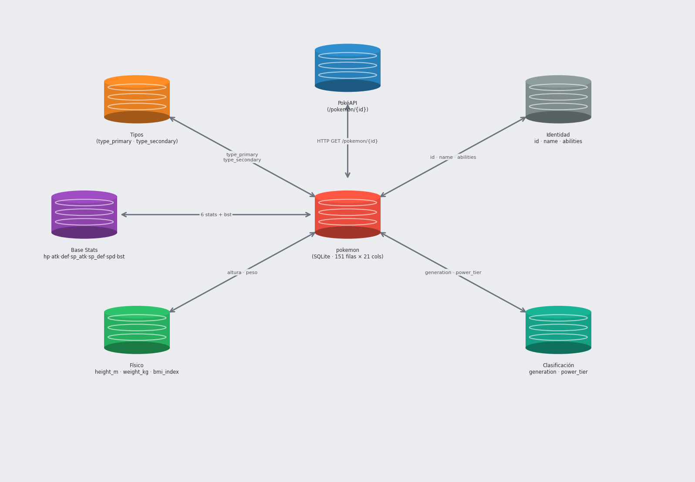

# Pokemon ETL — Pipeline de Datos con PokéAPI

Proyecto de portafolio que implementa un **pipeline ETL completo** consumiendo la [PokéAPI](https://pokeapi.co/), limpiando los datos y presentándolos en una interfaz web interactiva construida con Streamlit.

---

## Inicio rapido

| Quiero... | Comando |
|-----------|---------|
| **Ver el dashboard interactivo** | `streamlit run app.py` |
| Ejecutar el pipeline ETL completo | `python main.py --limit 151` |
| Solo descargar datos de la API | `python main.py --phase extract` |
| Solo limpiar y transformar datos | `python main.py --phase transform` |
| Solo exportar a SQLite + graficas | `python main.py --phase load` |

> El dashboard se abre automaticamente en `http://localhost:8501` — no requiere ejecutar el ETL primero, los datos ya estan incluidos en `data/`.

---

## Diagrama de Flujo del Pipeline



---

## Esquema de Datos



> Modelo estrella: la tabla `pokemon` (SQLite · 151 filas × 21 columnas) al centro, alimentada por la PokéAPI y organizada en grupos de columnas por categoría. Generado con `python scripts/generate_schema.py`.

---

## ¿Qué hace este proyecto?

| Fase | Módulo | Descripción |
|------|--------|-------------|
| **Extract** | `src/extract/api_client.py` | Consume la PokéAPI (REST, sin auth). Descarga datos de Pokémon, tipos, habilidades y estadísticas base. Maneja rate limiting y reintentos automáticos con `tenacity`. |
| **Transform** | `src/transform/cleaner.py` | Desanida JSON complejo (stats, types, abilities son arrays). Normaliza a snake_case. Calcula BST, IMC, categorías de poder y clasifica por generación. |
| **Load** | `src/load/exporter.py` | Exporta a CSV y SQLite. Genera dashboard interactivo (Plotly) y reporte estático (Matplotlib + Seaborn). |
| **Visualize** | `app.py` | App Streamlit con KPIs, filtros interactivos, explorador de datos y gráficas para portafolio. |

---

## Estructura del Proyecto

```
Proyecto 2 CV/
├── app.py                          <- DASHBOARD   →  streamlit run app.py
├── main.py                         <- PIPELINE    →  python main.py --limit 151
│
├── README.md / README.pdf          <- Documentación del proyecto
├── TASK.md                         <- Guía de ejecución (referencia rápida)
├── requirements.txt                <- Dependencias Python
├── .env.example                    <- Plantilla de variables de entorno
│
├── assets/                         <- Recursos estáticos de la interfaz
│   └── Font-pokemon.png            <- Logotipo usado en el dashboard
│
├── src/                            <- Código fuente del pipeline ETL
│   ├── config.py                   <- Rutas, variables de entorno y constantes
│   ├── extract/
│   │   └── api_client.py           <- Cliente HTTP (PokéAPI + retry tenacity)
│   ├── transform/
│   │   └── cleaner.py              <- Normalización, BST, power_tier, IMC
│   └── load/
│       └── exporter.py             <- SQLite + Plotly HTML + Matplotlib PNG
│
├── data/
│   ├── raw/                        <- JSON crudo descargado de la API  [gitignore]
│   ├── processed/                  <- pokemon_clean.csv (151 × 21 columnas)
│   └── output/                     <- pokemon.db, dashboard.html, reports
│
├── notebooks/
│   └── 01_eda_pokemon.ipynb        <- Análisis exploratorio (EDA) del dataset
│
├── tests/
│   ├── conftest.py                 <- Fixtures compartidos para pytest
│   ├── test_extract.py             <- Tests del cliente PokéAPI
│   └── test_transform.py           <- Tests de limpieza y cálculo de campos
│
├── scripts/
│   ├── generate_flowchart.py       <- Genera data/output/etl_flowchart.png
│   └── generate_pdf.py             <- Convierte README.md → README.pdf
│
├── docs/                           <- Documentación técnica del proyecto
│   ├── MANUAL_ETL.md               <- Manual conceptual del pipeline (ETL, conceptos, entrevista)
│   └── MANUAL_VISUAL.md            <- Manual del dashboard (diseño, CSS, componentes)
│
├── superset/                       <- Exploración BI opcional con Apache Superset
│   └── README.md                   <- Instrucciones de setup y conexión
│
└── logs/                           <- Logs de cada ejecución  [gitignore]
```

---

## Dataset generado

El pipeline produce **151 registros** (Generación I) con **21 columnas**:

| Columna | Tipo | Descripción |
|---------|------|-------------|
| `id` | int | ID oficial de la PokéAPI |
| `name` | str | Nombre del Pokémon |
| `type_primary` | str | Tipo principal |
| `type_secondary` | str / NaN | Tipo secundario (si existe) |
| `hp` · `attack` · `defense` | int | Estadísticas base individuales |
| `special_attack` · `special_defense` · `speed` | int | Estadísticas base individuales |
| `bst` | int | Base Stat Total (suma de las 6 stats) |
| `generation` | int | Generación (1–8) por rango de ID |
| `height_m` | float | Altura en metros |
| `weight_kg` | float | Peso en kilogramos |
| `bmi_index` | float | Índice peso/altura² |
| `power_tier` | category | Categoría de poder (Very Low → Legendary) |
| `abilities` | str | Lista de habilidades separadas por coma |

---

## Análisis incluidos

| Visualización | Herramienta | Descripción |
|---------------|-------------|-------------|
| Distribución de tipos primarios | Plotly + Seaborn | ¿Cuáles tipos son más comunes? |
| Top 20 Pokémon por BST | Plotly | Los más poderosos en estadísticas totales |
| Correlación de estadísticas | Heatmap | ¿Ataque vs Defensa? ¿Velocidad vs BST? |
| Distribución BST por generación | Boxplot | Variabilidad del poder por generación |
| Ataque vs Defensa | Scatter | Segmentación ofensiva vs defensiva |
| Distribución de BST | Histograma | Concentración del poder en la población |

---

## Tecnologías

| Categoría | Librería | Versión | Uso |
|-----------|----------|---------|-----|
| HTTP | `requests` + `tenacity` | 2.32 / 8.5 | Consumo de API con retry exponencial |
| Datos | `pandas` + `numpy` | 3.x / 2.x | Manipulación y limpieza |
| Viz interactiva | `plotly` | 6.x | Dashboard HTML |
| Viz estática | `matplotlib` + `seaborn` | 3.10 / 0.13 | Reporte PNG |
| Interfaz web | `streamlit` | 1.x | App de portafolio |
| Almacenamiento | `sqlite3` | stdlib | Persistencia relacional |
| Config | `python-dotenv` + `loguru` | — | Entorno y logging |
| Tests | `pytest` + `responses` | — | Tests unitarios |

---

## Inicio Rápido

```bash
# 1. Crear entorno virtual e instalar dependencias
python -m venv venv && source venv/bin/activate
pip install -r requirements.txt

# 2. Configurar variables de entorno
cp .env.example .env

# 3. Ejecutar el pipeline ETL completo (extrae, transforma y carga)
python main.py --limit 151

# 4. Abrir la interfaz web interactiva (portafolio)
streamlit run app.py

# 5. Generar el diagrama de flujo PNG
python scripts/generate_flowchart.py

# 6. Ejecutar solo una fase
python main.py --phase extract
python main.py --phase transform
python main.py --phase load
```

---

## Documentación

| Manual | Descripción |
|--------|-------------|
| [`docs/MANUAL_ETL.md`](docs/MANUAL_ETL.md) | Guía técnico-conceptual del pipeline: Extract, Transform, Load, testing, glosario y guía de entrevista |
| [`docs/MANUAL_VISUAL.md`](docs/MANUAL_VISUAL.md) | Manual del dashboard: sistema de diseño, CSS en Streamlit, componentes, visualizaciones y navegación |

---

## Decisiones de diseño

**¿Por qué Streamlit y no Node.js?**
Para un perfil de **Data Analyst**, Streamlit es la elección correcta: es Python puro, permite construir dashboards interactivos sin salir del ecosistema de datos, y es reconocido por equipos de analytics como herramienta de producción. Node.js tiene sentido en perfiles Data Engineer / Full-Stack, pero para DA demuestra las habilidades equivocadas.

**¿Por qué SQLite y no PostgreSQL?**
El proyecto es de portafolio y corre localmente. SQLite elimina dependencias externas y permite hacer queries SQL ad-hoc directamente con cualquier cliente (DBeaver, TablePlus, etc.) sin configuración adicional.

**¿Por qué JSON crudo antes del CSV?**
Separar el raw de la API del dato procesado es una práctica de data engineering real: si cambia la lógica de transformación, se puede re-procesar sin volver a consumir la API.

---

**PokéAPI:** `https://pokeapi.co/api/v2/` — Pública, sin autenticación, límite ~100 req/min.
